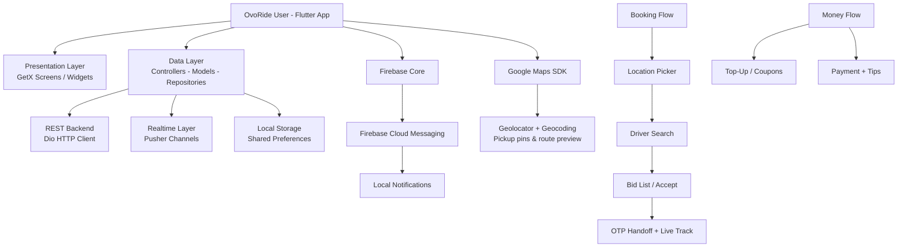

<p align="center">
  
</p>

<p align="center">
  
  
  
  
</p>

> **Developed by [Arslan Malik](https://github.com/arsalanmaalik461)**
> 📱 WhatsApp: [+92 300 8987448](https://wa.me/923008987448) · 🌐 Website: [arslanmalik.tech](https://arslanmalik.tech)

---

## 🌟 Executive Overview

**OvoRide User** is the rider-side mobile application of the OvoRide ride-sharing platform — a complete Flutter app that lets passengers book city and intercity rides, compare driver bids, track their driver live on the map, pay and tip in-app, and manage their whole travel history. It is the passenger's companion to the OvoRide Driver app, sharing the same backend, Firebase project (`ovo-ride`), and real-time infrastructure.

The app follows a GetX-driven layered architecture: screens and widgets under `lib/presentation/screens/` talk to controllers, which call Dio-backed repositories against the REST API, while Pusher channels deliver live ride events and Firebase Cloud Messaging powers notifications. The booking experience is map-first — a location picker, polyline route preview, driver-searching state, and an OTP handoff when the driver arrives keep the trip transparent from request to drop-off.

Beyond booking, the app covers the full rider account: coupons, wallet top-ups, payment history, driver reviews, referrals, in-ride chat, emergency SOS, support tickets, and multi-language settings.

---

## 📑 Table of Contents

- [✨ Key Features & Highlights](#-key-features--highlights)
- [🖥️ Feature Showcase](#️-feature-showcase)
- [🏗️ System Architecture](#️-system-architecture)
- [🚀 Quickstart & Installation Guide](#-quickstart--installation-guide)
- [📂 Project Structure](#-project-structure)
- [🛡️ Security & Notes](#️-security--notes)

---

## ✨ Key Features & Highlights

| Feature | Description |
| :--- | :--- |
| 🗺️ Map-First Booking | Location picker, polyline route preview, and live driver-searching state |
| 🚕 City + Intercity Rides | Separate flows for daily city trips and longer intercity travel |
| 💸 Driver Bid List | See incoming driver bids on your ride request, compare, and cancel |
| 🔢 Ride OTP Handoff | OTP shown to the driver at pickup for a secure trip start |
| 🆘 SOS Safety | Emergency SOS bottom sheet during active rides |
| 💳 Payments & Tips | Pay for rides, add tips via bottom sheet, full payment history |
| 💰 Top-Up & Coupons | Wallet top-up with payment method cards, coupon redemption screens |
| ⭐ Driver Reviews | Rate drivers with star ratings, review car info, and browse review history |
| 🎁 Refer-a-Friend | Referral screen to invite friends to the platform |
| 💬 In-Ride Chat | Ride message screen for rider ↔ driver messaging |
| 🎫 Support Tickets | Raise tickets with attachments and track replies |
| 🔔 Push + Local Notifications | Firebase Cloud Messaging wired into flutter_local_notifications |
| 📡 Real-Time Updates | Pusher channels service for live ride and bid events |
| 🔐 Auth Suite | Login, registration, SMS/email verification, forgot password, Google & Apple sign-in |
| 🌍 Multi-Language | Language selection with persisted locale |
| 🧭 Onboarding & Extras | Animated onboarding, FAQ, privacy policy, maintenance mode, web views |

---

## 🖥️ Feature Showcase

### 1. Booking & Live Tracking

> "Pin your pickup on the map, watch the route draw itself, and follow your driver's arrival in real time."

- `location/screen/` — location picker and edit screens
- `location/widgets/poly_line_map` — route preview with polylines
- `driver_searching_widget` — live "finding your driver" state
- `ride_details_screen` — driver profile, ride details, review bottom sheet

### 2. Bid Marketplace

> "Drivers bid on your ride — compare offers and pick the one that fits your budget."

- `ride_bid_list/` — incoming driver bids with `bid_card` widgets
- `cancel_bottom_sheet` — cancel the request gracefully
- Ride states mirrored live via the Pusher service

### 3. Payments, Tips & Coupons

> "Pay, tip, and save — the wallet covers the whole money side of the ride."

- `payment/` — payment screen with `tips_bottom_sheet_body`
- `topup_screen/` — add balance with selectable payment method cards
- `payment_history/` — audit every charge · `coupon/` — redeem discount coupons

### 4. Safety & Support

> "SOS during a ride, tickets after — the app keeps a safety net around every trip."

- `ride/widget/sos_bottom_sheet_body` + `location/widgets/ride_sos_bottom_sheet_body` — emergency SOS
- `ticket/` — new ticket with attachments, threaded replies, status tracking
- `inbox/` — direct ride messaging

---

## 🏗️ System Architecture



**Flow in plain terms:** the rider pins a location → the request goes out through the REST API → Pusher streams driver bids and status changes back → FCM/local notifications alert on key events → Google Maps renders the route with polylines and the driver's live position. Payments and tips run through the in-app money module, and support/safety features ride on the same stack.

---

## 🚀 Quickstart & Installation Guide

### Prerequisites

- **Flutter SDK** (Dart `>=3.5.0 <4.0.0`, per `pubspec.yaml`)
- Android Studio / Xcode for device builds
- A Google Maps API key
- Firebase project credentials (`google-services.json` for Android, `GoogleService-Info.plist` for iOS) for the `ovo-ride` Firebase project
- Backend API base URL (see `lib/environment.dart`)

### Step-by-Step Installation

```bash
# 1. Clone the repository
git clone https://github.com/arsalanmaalik461/rideuser.git
cd rideuser

# 2. Install dependencies
flutter pub get

# 3. Configure the environment
#    Open lib/environment.dart and set your API base URL and Google Maps key

# 4. Add Firebase configs
#    android/app/google-services.json
#    ios/Runner/GoogleService-Info.plist

# 5. Run on a device or emulator
flutter run

# Build release artifacts
flutter build apk --release
flutter build ios --release
```

---

## 📂 Project Structure

```
rideuser/
├── android/                  # Android native shell (Firebase, Maps config)
├── ios/                      # iOS native shell
├── assets/
│   ├── images/               # App images, logos, onboarding art
│   ├── img/                  # Icons, map markers, banners
│   ├── icon/                 # Feature icons
│   ├── animation/            # Lottie animations
│   └── fonts/                # Inter family (Black → Thin)
├── lib/
│   ├── main.dart             # App entry point
│   ├── environment.dart      # API base URL, Maps key, feature flags
│   ├── firebase_options.dart # Generated Firebase configuration
│   ├── core/
│   │   ├── di_service/       # Dependency injection setup
│   │   ├── route/            # GetX route definitions
│   │   ├── theme/            # App theming
│   │   └── helper/ utils/    # Shared helpers and utilities
│   ├── data/
│   │   ├── controller/       # GetX controllers (business logic)
│   │   ├── model/            # Data models
│   │   ├── repo/             # Dio repositories (API calls)
│   │   └── services/         # Pusher, local storage, notifications
│   └── presentation/
│       └── screens/          # Feature screens: auth, home, location,
│                             # ride_bid_list, ride, payment, topup_screen,
│                             # coupon, review, referral_a_friends, ticket,
│                             # inbox, profile…
├── firebase.json             # Firebase project wiring
├── pubspec.yaml              # Dependencies (GetX, Dio, Pusher, FCM…)
└── README.md
```

---

## 🛡️ Security & Notes

- **API keys are configuration, not code:** `lib/environment.dart` holds the Maps key and backend URL — replace with your own values before building.
- **Never commit Firebase credentials:** `google-services.json` and `GoogleService-Info.plist` are app-specific secrets; keep them out of version control.
- **OTP handoff** (`ride_otp_widget`) ensures the driver can only start the trip with the rider's code — don't share it outside the ride.
- **SOS and account deletion** are built in (`ride_sos_bottom_sheet_body`, delete-account flow) — location permission is essential for booking and tracking.
- Version: `1.0.0+1`. Built with Flutter/Dart (`>=3.5.0 <4.0.0`).

---

<p align="center">
  <sub>Developed with ❤️ by <a href="https://github.com/arsalanmaalik461">Arslan Malik</a> · 📱 <a href="https://wa.me/923008987448">WhatsApp: +92 300 8987448</a> · 🌐 <a href="https://arslanmalik.tech">arslanmalik.tech</a></sub>
</p>
